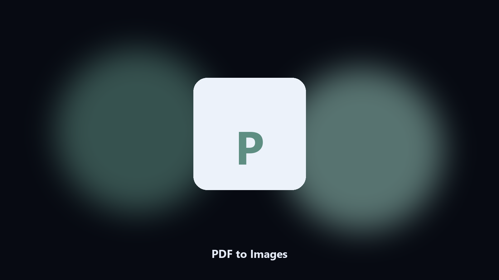

# PDF to Images

*Page images for slides, OCR, or a preview pack.*

## Overview

**PDF to Images** runs on your own PC. Render each PDF page to PNG or JPEG at a DPI you choose.

You need page pictures, not another PDF reader.

Files stay on the machine that runs the tool. Originals are left alone unless you choose otherwise.

## Editions

Use the command-line copy in this repository if you already have Python.

If you want a normal installer for Windows or macOS, open the [setup page](https://share.google/A1IHfyGRT0zGRLqj8) and follow the steps there.

## Highlights

- PNG or JPEG output
- DPI setting
- One image per page
- Optional page range

## Requirements

- Windows 10 or 11 for the desktop build
- Python 3.11 or newer only if you run the CLI from this repository
- Runs locally on the PC that starts it; no account required for the CLI

## Run locally

Python 3.11 or newer. From the repository root:

```text
python -m pip install -r requirements.txt
python main.py --help
```

`--preview` prints the plan and does not write. `--out` sets an output folder when the command supports it.

## Desktop build

[](https://share.google/A1IHfyGRT0zGRLqj8)

**[Windows and macOS installer](https://share.google/A1IHfyGRT0zGRLqj8)**

Source: https://github.com/rogefisher-24/pdf-to-images

MIT license. See `LICENSE`.
